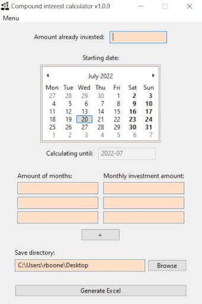
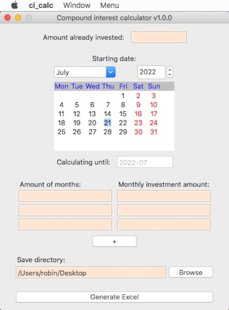

# Compound interest calculator  
  
  
A free application to generate the compound interest possibilities for your specific situation.  
Full explanation @ [projub.com](https://projub.com/compound_interest_calculator)  

  

## Copyright notice
Copyright (c) 2022 Robin Boone [License](LICENSE.md)

pandas package:  
Copyright (c) 2008-2011, AQR Capital Management, LLC, Lambda Foundry, Inc. and PyData Development Team
All rights reserved. Copyright (c) 2011-2021, Open source contributors.  
xlsxwriter package:  
Copyright (c) 2013-2022, John McNamara <jmcnamara@cpan.org>  
